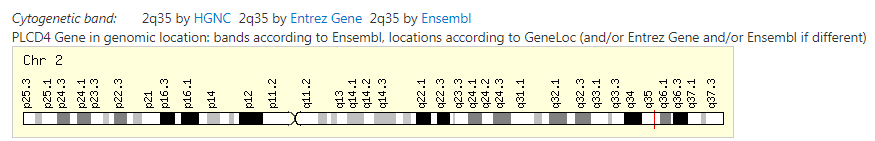
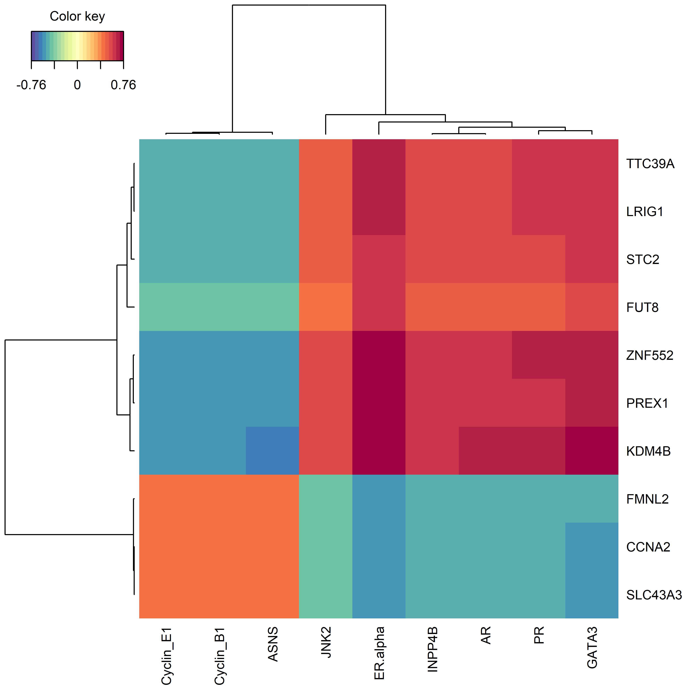
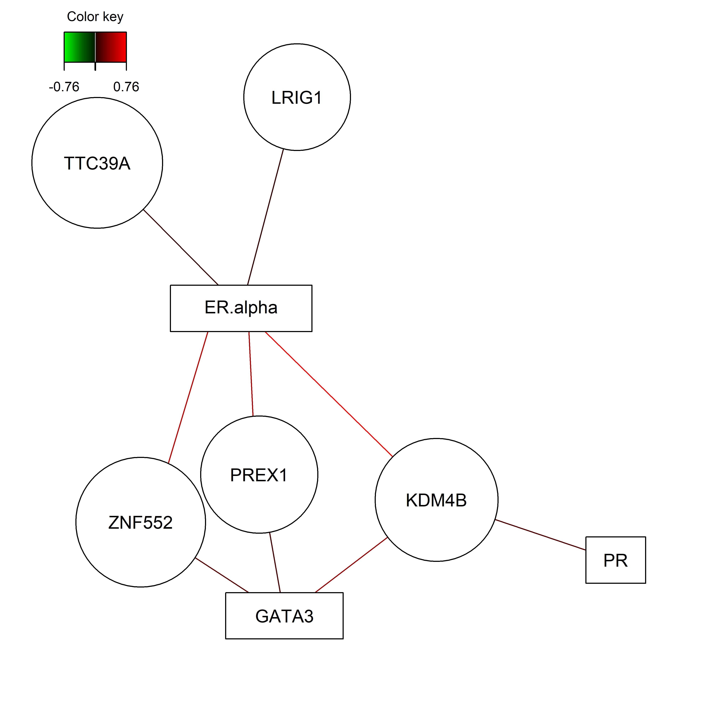
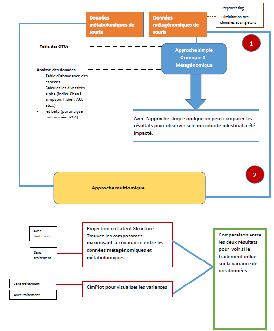

## Consignes

Vous avez jusqu'au 30 Octobre 2020 pour rendre le devoir. Vous devez nous
remettre un fichier Rmd qui contient les réponses à toutes les questions.
Vous inclurez également **toutes les commandes** qui vous ont permises de répondre
aux questions.

N'oubliez pas d'inclure le nom et le prénom de tous les membres de l'équipe.

Vous pouvez nous joindre aux adresses suivantes:

* Arnaud Droit: Arnaud.Droit@crchudequebec.ulaval.ca
* Antoine Bodein: Antoine.Bodein@crchudequebec.ulaval.ca
* Charles Joly Beauparlant: Charles.Joly-Beauparlant@crchudequebec.ulaval.ca

## Objectifs

Utiliser les méthodes vu en cours pour intégrer des données multi-omiques.
Une grande partie du TP est réalisé grâce à la suite d'outils `mixOmics`.
De l'aide est disponible sur leur site (http://mixomics.org/).

---

# I) Partie I

## 1). Préparation

1. Chargez le package `mixOmics`

```{r}
#if (!requireNamespace("BiocManager", quietly = TRUE))
  #install.packages("BiocManager")

#BiocManager::install("mixOmics")

#if (!requireNamespace("BiocManager", quietly = TRUE))
  #install.packages("BiocManager")

#BiocManager::install("timeOmics")

library("timeOmics")
library("mixOmics")


#install.packages("tidyverse")
library("tidyverse")

# pour la librairie lmms :
#install.packages("devtools")
#devtools::install_github("cran/lmms")
library("lmms")

```


2. Téléchargez et importez les données (4 fichiers: `mirna.csv`, `mrna.csv`, `protein.csv`, `sample_group.csv`)

```{r}
data_mirna = read.csv("mirna.csv")
data_mrna = read.csv("mrna.csv")
data_protein = read.csv("protein.csv")
data_sample = read.csv("sample_group.csv")

```
**Question 1:** Combien avez-vous d'échantillons ? de variables (mRNA, protéines, miRNA) ?
Nous disposons de 150 observations (échantillons) dans chaqun de nos jeux de données
Pour miRNA = 185 variables
Pour mRNA = 201 variables 
Pour protéines =  143 variables


3. Le coefficient de variation est défini comme le rapport entre l'écart-type $\sigma$ et la moyenne $\mu$ : $c_v = \frac{\sigma}{\mu}$
Construisez un fonction qui calcule le coefficient de variation à partir d'un vecteur.

```{r}
# Pour le jeu des miRNA

coeff_var <- function(data){
   moy = apply(data[,2:dim(data)[2]], 2, mean)
   std = apply(data[,2:dim(data)[2]],2, sd)
   coeff = NULL
   for (i in c(1:length(moy))){
      coeff = c(coeff, std[i] / moy[i])
   }
   names(coeff) = colnames(data[,2:dim(data)[2]])
   return (coeff)
}
coeff_miRNA = coeff_var(data_mirna)
coeff_mRNA = coeff_var(data_mrna)
coeff_protein = coeff_var(data_protein)
```

4. A l'aide d'un histogramme `hist()` affichez la distribution de chacun des blocs.
```{r}
par(mfrow = c(1,3))
hist(coeff_miRNA)
hist(coeff_mRNA)
hist(coeff_protein)
```

**Question 2:** La distribution des coefficients de variation est-elle similaire dans les 3 blocs ?
Si oui, quel type de donnée possède le plus de variabilité ?

La distribution des coefficients des miRNA et des mRNA est plutot similaire, mais pas du tout pour les protéines. 
L'axe des x semble plus variable pour les protéines que ARNm et miARN, comme on peut le voir plus bas avec les valeurs de variances et d'étendue. 

```{r}
print("miRNA variance et étenude :")
print(var(coeff_miRNA))
print(max(coeff_miRNA) - min(coeff_miRNA))
print("mRNA variance et étenude :")
print(var(coeff_mRNA))
print(max(coeff_mRNA) - min(coeff_mRNA))
print("proteine variance et étenude :")
print(var(coeff_protein))
print(max(coeff_protein) - min(coeff_protein))
```

5. Pour chacun des blocs, filtrez les données les plus variantes : |coeff| >= 0.15
```{r}
coeff_miRNA_filtr <- coeff_miRNA[which(abs(coeff_miRNA) >= 0.15)]
coeff_mRNA_filtr <- coeff_mRNA[which(abs(coeff_mRNA) >= 0.15)]
coeff_protein_filtr <- coeff_protein[which(abs(coeff_protein) >= 0.15)]

length(coeff_miRNA)
length(coeff_miRNA_filtr)

length(coeff_mRNA)
length(coeff_mRNA_filtr)

length(coeff_protein)
length(coeff_protein_filtr)


```
**Question 3:**: Combien reste-il de gènes ? de protéines ? de miRNA ?
miRNA : 82 gènes restants
mRNA : 174 gènes restants
protéine : 142 (toutes les protéine restent)

**Question 4:** Quel est le gène le plus variant ? La protéine associé à ce gène est-elle présente dans le jeu de donnée ?

```{r}
coeff_mRNA_filtr[which(coeff_mRNA_filtr == max(coeff_mRNA_filtr))] 
which(colnames(data_protein) == "PLCD4")

```
Le gène le plus variant est le gène "PLCD4" (Phospholipase C Delta 4)
La protéine associée à ce gène ne semble pas être dans le jeu de données. 


**Question 5:** A l'aide des bases de donnée de votre choix répondez aux questions suivantes:

 * Quel est le rôle de ce gène ? 
Il joue un rôle dans plusieurs processus cellulaires par l'hydrolisation du phosphatidylinositol 4,5-bisphosphate en deux seconds messagers intracellulaires

 * Sur quel chromosome est-il localisé ? 
chromosome 2 :


 * Quelle est la longueur en nucléotide de sa séquence ?
30316 bp
 * Quelle est la longueur en acides aminés de la protéine associée (ou des isoformes) ?
762 amino acids
\newpage

# Partie II

## 1. Single-omic: l'ACP avec `mixOmics`

**Question 6:** A quoi sert l'Analyse en Composante Principale ? Expliquez brievement sont fonctionnement ?
L'Analyse en Composantes Principale est une méthode qui consiste à résumer un tableau en réduisant à un espace de dimension réduite tout en perdant le moins d'information, chaque dimension résumera quelques variables et pourra être interprétée, l'objectif étant de faire le bilan des corrélations entre variables, évaluer les ressemblances et différences entre individus, ainsi qu'évaluer les relations entre les individus et les variables.

1. Réaliser l'ACP sur les données mRNA.
```{r}
library(FactoMineR)
library(factoextra)

acp = PCA(data_mrna[,2:dim(data_mrna)[2]])
fviz_pca_var(acp, col.var = "cos2")

barplot(acp$eig[,1],main="valeur propre",names.arg=1:nrow(acp$eig))
```

**Question 7:** Combien de composantes retenez-vous ? Justifiez / Illustrez
```{r}
acp = PCA(data_mrna[,2:dim(data_mrna)[2]])
#plot(acp$eig[,1],main="valeur propre",names.arg=1:nrow(acp$eig), type = "l")
fviz_eig(acp, geom="line")
# On garde 3 composantes
```
On garde 3 composantes, comme on peut le voir sur la figure plus haut le pourcentage de variance expliqué n'est pas très élevé avec 3 composante mais rajouter d'autres composantes ne nous permettrait pas de bien mieux améliorer l'information


2. Après avoir relancer l'ACP avec le bon nombre de composante, utiliser un graphique pour représenter les variables.

```{r}
acp = PCA(data_mrna[,2:dim(data_mrna)[2]], ncp =3)
fviz_pca_var(acp, col.var = "cos2", ncp =3)

```

**Question 8:** Quelles sont les variables qui contribuent le plus à l'axe 1 ?

```{r}
fviz_contrib(acp, choice = "var", axes = 1, top = 20)

```

3. Avec un graphique, représenter les échantillons dans l'espace formé par les composantes. 
Les échantillons sont colorés en fonction du groupe. Affichez la légende et ajoutez un titre.

```{r}
data_mrna$grp = data_sample[,2]

fviz_pca_ind(acp,addEllipses = TRUE,col.ind = data_mrna$grp, legend.title = "Groups", title = "Plot des individus des composantes princiaples 1 et 2.")

```

4. La *sparse ACP* `spca()` implémente une étape de *feature selection*. En utilisant la documentation de la fonction et/ou l'aide disponible en ligne,  utilisez la `spca()` de manière a sélectionner 10 gènes sur la première composante et 5 gènes sur la seconde composante.

```{r}
mySpca <- spca(data_mrna[,2:201], keepX = c(10,5))

plotVar(mySpca, overlap = FALSE, cex = 3)

```

**Question 9:** Quelles sont les gènes que vous avez sélectionnés? *(une fonction est disponible)*

```{r}
sel1 =selectVar(mySpca, comp = 1)
sel2 = selectVar(mySpca, comp = 2)

print("composante 1 :")
sel1$name
```

```{r}
print("composante 2 :")
sel2$name
```

```{r}
plotLoadings(mySpca, comp=1)
plotLoadings(mySpca, comp=2)
```


###########################################
## 2. Projection on Latent Structures

1. Réalisez une PLS `pls()` avec les données mRNA et protéines en incluant 3 composantes `(ncomp = 3)`.

```{r}
mRNA = data_mrna[,2:201]
prot = data_protein[,-1]

pls_data = pls(mRNA,prot , ncomp=3)
```


**Question 10:** A quoi sert la régression PLS pour l'intégration multi-omique?
La Régression des moindres carrés partiels ou PLS est une méthode de régression avec laquelle on va tenter d’expliquer des variables Y par des variables prédicteurs X et cela en maximisant la variance X et maximisant la corrélation entre X et Y.

2. Affichez un *scatter plot* des échantillons en affichant uniquement les composantes 2 et 3.
Les échantillons doivent être coloriés par groupe. Ajoutez une légende et un titre.

```{r}
plotIndiv(pls_data,group=data_mrna$grp,comp=c(2,3), legend = T, ellipse = TRUE, ind.names = FALSE, title = "Scatterplot des échantillons sur les composantes 2 et 3")
```

3. Affichez un *arrow plot* en affichant uniquement les composantes 1 et 3.
Les flèches doivent être coloriés par groupe. Ajoutez une légende et un titre.

```{r}

plotArrow(pls_data,group=data_mrna$grp,comp=c(1,3),legend = T, title = "Arrow plot du modèle PLS  des mRNA et protéine")

```

4. La *sparse PLS* `spls()` implémente une étape de *feature selection*. En utilisant la documentation de la fonction et/ou l'aide disponible en ligne,  utilisez la *sPLS* de manière a sélectionner (10 gènes, 9 protéines) sur la première composante, (5 gènes, 5 protéines) sur la seconde composante et (1 gène, 1 protéine) sur la troisième composante.

```{r}

Myspls <- spls(mRNA, prot,ncomp=3, keepX=c(10,5,1), keepY = c(9,5,1))

plotVar(Myspls, cex = c(4,4))

```

**Question 11:** Quels sont les variables sélectionnées sur la troisième composante.

```{r}
var_comp3 = selectVar(Myspls, comp = 3)
print("les variables mRNA sélectionnées sur la composante 3 :")
var_comp3$X$name  

```
```{r}
print("les variables protéines sélectionnées sur la composante 3 :")
var_comp3$Y$name
```

5. Affichez un *CIM plot* à partir du modèle *sPLS*.

```{r}

X11()
plscimplt = cim(Myspls, comp = 1)
cim(Myspls, comp = 1, save = 'jpeg', name.save = 'PLScim')

```


**Question 12:** Quels sont les gènes et les protéines les plus corrélés? Justifiez à partir de la matrice de corrélation calculée par `cim()`.

```{r}

plscimplt$mat.cor

c = which(plscimplt$mat.cor > 0.6)#== max(plscimplt$mat.cor))
t = plscimplt$mat.cor[c]

```
les protéines les plus corrélées sont : "ER.alpha" et "KDM4B" avec un coefficient de 0.7611228

6. Toujours à partir du même modèle *sPLS*, affichez un *network plot* en affichant uniquement les les corrélations les plus forte $(\rho \pm 0.65)$.

```{r}
X11()
network(Myspls, comp = 1, cutoff = 0.65, save = 'jpeg', name.save = 'PLSnetwork')

```


**Question 13:** Combien de clusters / sous-graphes observés vous ?
Nous observons 4 sous-graphes


## 2. *multiblock* Projection on Latent Structures

1. Réalisez une multiblock PLS `pls()` avec les données mRNA, protéines et miRNA `(X = list(mrna, prot), Y = mirna)` en incluant 2 composantes `(ncomp = 2)`.

```{r}
mRNA = data_mrna[,2:201]
prot = data_protein[,-1]

multi_pls_data = pls(X = cbind(mRNA,prot), Y = as.matrix(data_mirna[,-1]), ncomp=2)
plotIndiv(multi_pls_data, ncomp = 2, group = data_mrna$grp, col.per.group = c("red","green","blue"), ellipse = TRUE, legend = TRUE, title = "multiblock Projection on Latent Structures")

```

2. Comme la `spls()`, la `block.spls()` implémente une étape de *feature selection*. En utilisant la documentation de la fonction et/ou l'aide disponible en ligne,  utilisez la fonction de manière a sélectionner (10 gènes, 9 protéines, 7 miRNA) sur la première composante et (5 gènes, 4 protéines, 3 miRNA) sur la seconde composante.


```{r}
mRNA = data_mrna[,2:201]
prot = data_protein[,-1]
```

```{r}
MyMultispls <- block.spls(X = list(mrna = mRNA, protein = prot), Y = as.matrix(as.data.frame(data_mirna[,-1])), ncomp = 2, keepX=list(mrna = c(10,5), protein = c(9,4)), keepY = c(7,3))

plotVar(MyMultispls, cex = c(3,3,3))

```

**Question 14:** Quels sont les variables sélectionnées sur la première composante.

```{r}
var_comp1_blockspls = selectVar(MyMultispls, comp = 1)
print("Variables mRNA seléctionées :")
var_comp1_blockspls$mrna$name
```
```{r}
print("Variables proteines seléctionées :" )
var_comp1_blockspls$protein$name
```


```{r}
print("Variables miRNA seléctionées :" )
var_comp1_blockspls$Y$name
```

## 3. Analyse supervisée : (s)PLS-DA

Le fichier `sample_groupe.csv` associe un groupe à chaque échantillon.

**Question 15:** Donnez la répartition des groupes. 
```{r}
barplot(table(data_sample$Y), col = c("red","green","blue"), main = "Histogramme de la répartition des groupes")
```


1. Utilisez la `pls.da()` en utilisant les gènes (`X`) et le groupe (`Y`) avec 2 composantes.
```{r}
X = data_mrna[,2:201]
Y = data_mrna$grp
Myplsda = plsda(X,Y, ncomp = 2)
```

2. Affichez le graphe des échantillons.

```{r}
plotIndiv(Myplsda, ind.names = FALSE, legend=TRUE,
          ellipse = TRUE, title = "PLS DA ")

```


**Question 16:** Comparez ce graphe avec le graphe des échantillons obtenu avec l'ACP (1.3). Quel méthode permet d'obtenir de meilleurs clusters?

```{r}

fviz_pca_ind(acp,addEllipses = TRUE,col.ind = data_mrna$grp, legend.title = "Groups", title = "Plot des individus des composantes princiaples 1 et 2.")

plotIndiv(Myplsda, ind.names = FALSE, legend=TRUE,
          ellipse = TRUE, title = "PLS DA ")

```
# Commentaire ######
La PLS DA semble nous donner de meilleurs résultats que l'ACP en effet comme on peut voir que les groupes sont bien mieux séparés dans le plot de la PLS DA que dans celui de l'ACP. Nous voyons bien 3 clusters distincs.


## 4. Analyse supervisée : block-(s)PLS-DA

1. Réalisez une multiblock sPLS-DA `block.splsda()` avec les données mRNA, protéines, miRNA `(X = list(mrna, prot, mirna))` et le groupe en incluant 5 composantes `(ncomp = 5)`.
```{r}
miRna = data_mirna[,-1]

Myblocksplsda = block.splsda(X = list(mrna = mRNA, protein = prot, mirna = miRna ), Y = data_mrna$grp, ncomp = 5)

plot(Myblocksplsda)

```
Nous observons une forte corrélations entre les données des différents data frame, cepdandant nous observons que la plus forte corrélation est entre mRNA et les protéines : 0.89.

2. Utiliser la fonction `perf()` sur le modèle obtenu. 
```{r}
myblocksplsda_perf = perf(Myblocksplsda, validation = "Mfold", folds = 5 ,progressBar = TRUE)
```


```{r}
plot(myblocksplsda_perf)
```


**Question 17:** Quelle serait le nombre de composante minimal à inclure ?
4 composante semble être le nombre de composantes minimal à inclure en effet on remarque qu'a partir de 4 composantes le taux d'erreur de classification ne diminue plus dans le meilleur des cas et augmente dans les pires

3. Relancez le modèle avec 2 composantes et utilisez l'option `keepX` pour sélectionner 15 gènes, protéines et miRNA sur la première compoante et 10 gènes, protéines et miRNA sur la seconde composante.
```{r}
Myblocksplsda2 = block.splsda(X = list(mrna = mRNA, protein = prot, mirna = miRna ), Y = data_mrna$grp, keepX = list(mrna = c(15,10),protein = c(15,10),mirna = c(15,10)),ncomp = 2)
```

```{r}
plot(Myblocksplsda2)
```
Toujours avec la fonction block.splsda, mais avec deux composantes, et un certains nombres de gènes, protéine et miRNA sélétionnés, on observe toujous une forte corrélation entre varaibles. Et la corrélation entre mRNA et protéine reste la plus élévée. 

```{r}
perf_myblocksplsda2 = perf(Myblocksplsda2, validation = "Mfold", fold = 5, progressBar = TRUE)
```


```{r}
plot(perf_myblocksplsda2)
```

4. Réalisez un *circos plot* avec le modèle obtenu en affichant les corrélations fortes $|\rho| > 0.5$. Ajoutez un titre.

```{r}
circosPlot(Myblocksplsda2, cutoff = 0.7)
```
On observe de manière générale, plus de corrélation négative que positive. Cependant on observe quelques corrélations positive entre certaines variables de protéines, et certaines variable mRNA. 
Mais avec un cutoff de 0.5, il est difficile de dire quelle variable d'un jeu données est correlée avec quelle variable d'un autre jeu données.


------------------------------------------------

# Partie III

## 5. Mises en situation

Dans cette section, nous allons vous présenter deux designs expérimentaux et il
vous faudra déterminer quelle est l'approche analytique à privilégier pour
répondre aux questions demandées. Il s'agit d'intégrer à la fois l'informations
sur l'analyse bioinformatique en partant des données brutes mais également de
cibler les bonnes approches multiomiques.

1. Un de vos collègue s'intéresse aux effets de l'exposition à des polluants
   sur la santé des ours polaires. Pour ce faire, il a accès à des données
   transcriptomiques provenant d'une vingtaine de trios (une mère et sa portée
   de deux enfants) ainsi qu'à diverses mesures cliniques numériques pour tous
   les échantillons.
   
 Il s'agit ici de mettre en évidence l'exposition à des polluants sur la santé des ours polaires.
   Pour ce faire, nous disposons de données transcriptomiques (ARNm) et de mesures cliniques.
   Les étapes :
   
 a) Analyse exploratoires de nos données:
   => Visualisation des données exemple summary ()
   => Existe des NA, des valeurs nulles : voir ce qu'on on fait
   => Observation de la distribution de nos données : hist, bar plot etc..
   
 b) Normalisation des données si besoin.
 
 c) L'approche multiomique consisterai pour cette expérience en une PLS (Projection on Latent Structures)
    avec en X = Les données transcriptomiques et en Y = Les données cliniques. Cette analyse permettrai      de mettre en relief des covariances entre les deux jeux de données et, à terme, une représentation       graphique avec les composantes ayant le plus de variance expliquée, ce qui permettra d'identifier       les groupes (différentes couleurs) ayant le plus été exposés aux polluants.
   Une autre approche serait une PLSDA (PLS-Discriminant Analysis) avec en X nos deux jeux de données et    en Y nous supposerons que nous disposons de données qualitatives qui classent les ours qui ont été       fortement ou faiblement exposés aux polluants.
   Cette analyse permettrai d'identifier les composants qui sont le plus affectés par l'exposition aux      polluants et de chercher entre les ours mères et leurs portés. 


2. Vous travaillez sur un modèle murin et vous souhaitez comprendre les impacts
   d'un traitement sur le microbiote. Vous avez accès à des données de
   séquençage de type 16S ainsi qu'à des données de métabolomiques pour des
   souris traitées et pour des souris non-traitées. Vous pouvez prendre pour
   acquis que l'analyse primaire des données de métabolomiques a déjà été
   complétées et que vous avez déjà accès aux décomptes pour chaque molécules.
   

   
   
   
   